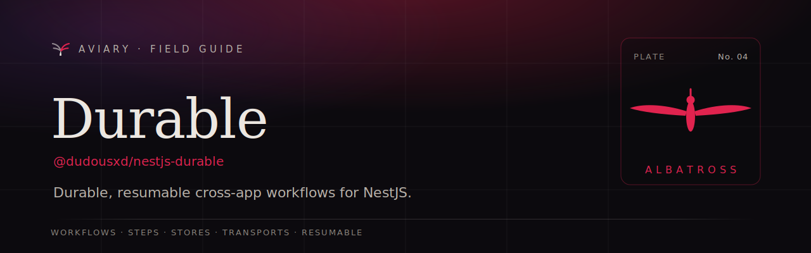

<p align="center">
  <a href="https://davidecarvalho.github.io/aviary/docs/durable">
    
  </a>
</p>

<p align="center">
  <b><a href="https://davidecarvalho.github.io/aviary/docs/durable">📖 Read the documentation</a></b>
  &nbsp;·&nbsp; part of the <a href="https://davidecarvalho.github.io/aviary/"><b>Aviary</b></a> ecosystem for NestJS
</p>

---

# nestjs-durable

Durable workflows for NestJS, with steps that can run across apps and languages.

Write a workflow as plain code. The engine checkpoints every step, so the flow survives
crashes and deploys and resumes exactly where it stopped. Some steps run locally in NestJS;
others run on a remote worker (Python first) — but it is **one workflow**, with **one source
of truth**, and **one end-to-end view**.

## Why

Today multi-service flows are scattered: a queue here, a queue there, a piece in Python, and
no single place to read or watch the whole flow. `nestjs-durable` collapses that into:

1. **The flow becomes code, in one place.** Read the workflow function, understand the whole
   sequence — even when steps execute in different apps.
2. **Durability.** Survives crash/deploy without re-running completed steps.
3. **End-to-end visibility.** Because one orchestrator owns the state, it knows about *every*
   step (including the Python ones), so a full-flow trace and dashboard come almost for free.

## Quick look

Define a remote step, write the workflow as plain code, and implement the step as a
provider method — it runs durably, in-process, with zero extra infrastructure:

```ts
// 1. Declare the step (typed contract, validated at the boundary)
export const chargeCard = remoteStep({
  name: 'payments.charge-card',
  input: z.object({ orderId: z.string(), amountCents: z.number().int() }),
  output: z.object({ chargeId: z.string() }),
  retries: 3,
});

// 2. The workflow — linear code; every step is checkpointed
@Workflow({ name: 'checkout', version: '1' })
class CheckoutWorkflow {
  async run(ctx: WorkflowCtx, order: Order) {
    await ctx.step('reserve-stock', async () => { /* local step */ });
    const charge = await ctx.call(chargeCard, { orderId: order.id, amountCents: order.total });
    return charge.chargeId;
  }
}

// 3. The step handler — a provider method, decoupled from the workflow
@Injectable()
class PaymentsWorker {
  @DurableStep('payments.charge-card')
  async charge(input: { orderId: string; amountCents: number }) {
    const res = await this.stripe.charge(input.orderId, input.amountCents);
    return { chargeId: res.id };
  }
}

// 4. Wire it up — event-emitter transport = no broker, single process
DurableModule.forRootAsync({
  inject: [EventEmitter2],
  useFactory: (emitter) => ({ store: myStore, transport: new EventEmitterTransport(emitter) }),
});
```

If the process crashes mid-`checkout`, it resumes on boot from the last checkpoint —
`reserveStock` and `chargeCard` are not re-run. Swap the transport for BullMQ/NATS to move
`PaymentsWorker` into a separate process or a Python worker, with no change to the workflow.

The split goes both ways. A remote worker can **implement a step** the NestJS workflow calls
(above), or **author the whole workflow** itself and call back into NestJS — the engine stays the
single owner of durable state either way. Register a remote workflow with
`engine.registerRemote(name, version, { group, executor })` and write the flow in the other language
(see the [Python SDK](clients/python/README.md#authoring-workflows-in-python-coordinator-driven)).

## Status

Built with TDD — durable engine (replay, retries, fatal errors, fan-out, sleep, signals,
recovery), NestJS integration, event-emitter transport, two ORM stores, the control-plane
dashboard, OpenTelemetry, a Telescope watcher, and the Python worker SDK. See
[`docs/plans`](docs/plans/2026-06-11-nestjs-durable-design.md) for the full design.

## Control plane vs worker

Split the roles when you want a shared, DB-owning dispatcher fronting many independent workers:

- **`DurableControlPlaneModule`** (`{ worker: false }`) — mounts the engine, the dashboard, and the
  store, and dispatches runs, but never processes or recovers workflows: each started run stays
  `pending` for a worker to claim. This is the instance that owns the database and the operator view.
  It can start runs on behalf of a tenant over the transport (`transport.onStartRun` → a run stamped
  with the tenant's `namespace`), and route unregistered workflows to a live group of the same name
  with `remoteByConvention: true`.
- **`DurableWorkerModule`** — a **tenant worker**: it registers `@Step`/`@Workflow` handlers and
  consumes the transport, holding no engine or store. It can start runs back through the control plane
  and, unless it opts into `scopeReads`, never reads another tenant's rows.

Use `DurableModule` directly when a single instance should be **both** dispatcher and worker (the
zero-infra default).

## Packages

| Package | Role | Status |
| --- | --- | --- |
| `@dudousxd/nestjs-durable-core` | Interfaces, engine, deterministic replay, sleep/signals, events | ✅ |
| `@dudousxd/nestjs-durable` | NestJS module, `@Workflow`/`@DurableStep`, recovery, timer poller, auto-schema | ✅ |
| `@dudousxd/nestjs-durable-transport-event-emitter` | In-process Transport (zero-infra default) | ✅ |
| `@dudousxd/nestjs-durable-transport-bullmq` | BullMQ/Redis Transport for cross-process / Python steps | ✅ |
| `@dudousxd/nestjs-durable-store-mikro-orm` · `-store-typeorm` · `-store-prisma` | `StateStore` on Postgres / MySQL / SQLite | ✅ |
| `@dudousxd/nestjs-durable-store-drizzle` | Drizzle `StateStore` (SQLite / libSQL) | ✅ |
| `@dudousxd/nestjs-durable-dashboard` | Embedded control-plane SPA (runs + timeline + retry/cancel) | ✅ |
| `@dudousxd/nestjs-durable-otel` | OpenTelemetry — trace per run, span per step | ✅ |
| `@dudousxd/nestjs-durable-telescope` | `@dudousxd/nestjs-telescope` watcher | ✅ |
| `@dudousxd/nestjs-durable-cli` | `durable inspect` — runs & timelines in the terminal | ✅ |
| `@dudousxd/nestjs-durable-testing` | Test harness, crash injection, replay assertions | ✅ |
| `durable-worker` (PyPI) | Python SDK + wire protocol — implement steps **and** author workflows | ✅ |

## License

MIT
