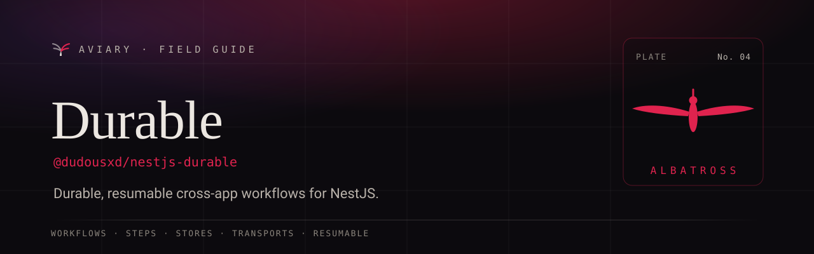

<p align="center">
  <a href="https://davidecarvalho.github.io/aviary/docs/durable">
    
  </a>
</p>

<p align="center">
  <b><a href="https://davidecarvalho.github.io/aviary/docs/durable">📖 Read the documentation</a></b>
  &nbsp;·&nbsp; part of the <a href="https://davidecarvalho.github.io/aviary/"><b>Aviary</b></a> ecosystem for NestJS
</p>

---

# nestjs-durable

Durable workflows for NestJS, with steps that can run across apps and languages.

Write a workflow as plain code. The engine checkpoints every step, so the flow survives
crashes and deploys and resumes exactly where it stopped. Some steps run locally in NestJS;
others run on a remote worker (Python first) — but it is **one workflow**, with **one source
of truth**, and **one end-to-end view**.

## Why

Today multi-service flows are scattered: a queue here, a queue there, a piece in Python, and
no single place to read or watch the whole flow. `nestjs-durable` collapses that into:

1. **The flow becomes code, in one place.** Read the workflow function, understand the whole
   sequence — even when steps execute in different apps.
2. **Durability.** Survives crash/deploy without re-running completed steps.
3. **End-to-end visibility.** Because one orchestrator owns the state, it knows about *every*
   step (including the Python ones), so a full-flow trace and dashboard come almost for free.

## Quick look

There is **one durable step primitive**: `ctx.step`. Write the workflow as plain code, implement
each step as a `@Step`-decorated provider method, and call it by **reference** — the engine
checkpoints it, retries it per its policy, and runs it durably whether it's served in this same
process (zero extra infrastructure) or by a separate/Python worker over a broker:

```ts
// 1. The step handler — a provider method, decoupled from the workflow. `@Step` derives the
//    routing name from the method (or take an explicit name for a stable cross-runtime contract);
//    optional zod schemas validate at the dispatch boundary.
@Injectable()
class PaymentsWorker {
  @Step({ name: 'payments.charge-card', retries: 3 })
  async charge(input: { orderId: string; amountCents: number }) {
    const res = await this.stripe.charge(input.orderId, input.amountCents);
    return { chargeId: res.id };
  }
}

// 2. The workflow — linear code; every step is checkpointed
@Workflow({ name: 'checkout', version: '1' })
class CheckoutWorkflow {
  constructor(private readonly payments: PaymentsWorker) {}

  async run(ctx: WorkflowCtx, order: Order) {
    // Method-reference form (JS): name + types are inferred from the `@Step`-stamped method.
    const charge = await ctx.step(this.payments.charge, {
      orderId: order.id,
      amountCents: order.total,
    });
    return charge.chargeId;
  }
}

// 3. Wire it up — event-emitter transport = no broker, single process
DurableModule.forRootAsync({
  inject: [EventEmitter2],
  useFactory: (emitter) => ({ store: myStore, transport: new EventEmitterTransport(emitter) }),
});
```

If the process crashes mid-`checkout`, it resumes on boot from the last checkpoint — `charge` is
not re-run. Swap the transport for BullMQ/NATS to move `PaymentsWorker` into a separate process or
a Python worker, with no change to the workflow — from the workflow's point of view every `ctx.step`
call looks identical regardless of where it's served.

Crossing a *language* boundary works the same way, just called by **string** instead of reference
(there's no JS symbol to import for a Python `@Step`): `ctx.step<ProcResult>('processing:proc', input)`.
Non-deterministic captures (an id, a timestamp) don't need a full dispatched step — use
`ctx.sideEffect(() => uuidv7())` or the built-in `ctx.now()` (epoch ms).

The split goes both ways. A remote worker can **implement a step** the NestJS workflow calls
(above), or **author the whole workflow** itself and call back into NestJS — the engine stays the
single owner of durable state either way. Crossing a *workflow* boundary (not just a step) is
`ctx.child`; a run started for a name a live worker group already serves is routed there by
convention, so you just write the flow in the other language (see the
[Python SDK](clients/python/README.md#authoring-workflows-in-python-coordinator-driven)).

## Status

Built with TDD — durable engine (replay, retries, fatal errors, fan-out, sleep, signals,
recovery), NestJS integration, event-emitter transport, two ORM stores, the control-plane
dashboard, OpenTelemetry, a Telescope watcher, and the Python worker SDK. See
[`docs/plans`](docs/plans/2026-06-11-nestjs-durable-design.md) for the full design.

## Operator vs worker

One `DurableModule.forRoot(options)` — the role is **inferred** from which of `store` / `connection`
you pass:

- **`{ store, transport }`** — an **operator**: mounts the engine, the dashboard, and the store, and
  drives runs (polls pending, recovers crashed, resumes timers). Pass `drive: false` for a
  read-only/dashboard replica (e.g. an API pod) that mounts the store but never processes or recovers
  workflows — leave that to another driving instance.
- **`{ connection }`** (no `store`) — a **thin worker**: no engine or store; it registers
  `@Step`/`@Workflow` handlers and consumes the transport directly.
- **`{ store, transport, connection }`** — an operator that also runs a co-located worker: every
  `@Workflow` dispatches over the transport instead of running inline, and a co-located consumer
  replays the same bodies.

An operator with no local body for a workflow automatically dispatches to a live worker of the same
name — that convention dispatch is the default, nothing to opt into. Use `partition` to isolate
multiple worker pools sharing one store/broker.

## Packages

| Package | Role | Status |
| --- | --- | --- |
| `@dudousxd/nestjs-durable-core` | Interfaces, engine, deterministic replay, sleep/signals, events | ✅ |
| `@dudousxd/nestjs-durable` | NestJS module, `@Workflow`/`@Step`, recovery, timer poller, auto-schema | ✅ |
| `@dudousxd/nestjs-durable-transport-event-emitter` | In-process Transport (zero-infra default) | ✅ |
| `@dudousxd/nestjs-durable-transport-bullmq` | BullMQ/Redis Transport for cross-process / Python steps | ✅ |
| `@dudousxd/nestjs-durable-store-mikro-orm` · `-store-typeorm` · `-store-prisma` | `StateStore` on Postgres / MySQL / SQLite | ✅ |
| `@dudousxd/nestjs-durable-store-drizzle` | Drizzle `StateStore` (SQLite / libSQL) | ✅ |
| `@dudousxd/nestjs-durable-dashboard` | Embedded control-plane SPA (runs + timeline + retry/cancel) | ✅ |
| `@dudousxd/nestjs-durable-otel` | OpenTelemetry — trace per run, span per step | ✅ |
| `@dudousxd/nestjs-durable-telescope` | `@dudousxd/nestjs-telescope` watcher | ✅ |
| `@dudousxd/nestjs-durable-cli` | `durable inspect` — runs & timelines in the terminal | ✅ |
| `@dudousxd/nestjs-durable-testing` | Test harness, crash injection, replay assertions | ✅ |
| `durable-worker` (PyPI) | Python SDK + wire protocol — implement steps **and** author workflows | ✅ |

## License

MIT
